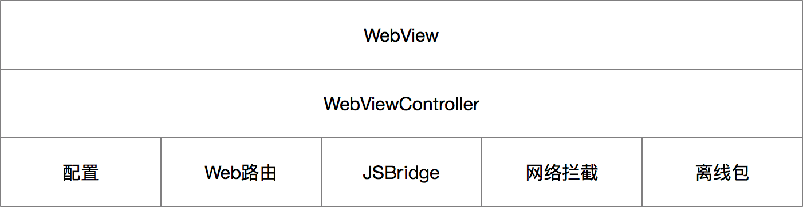
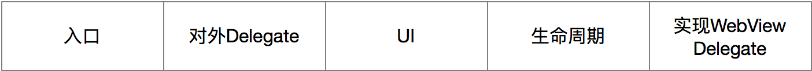
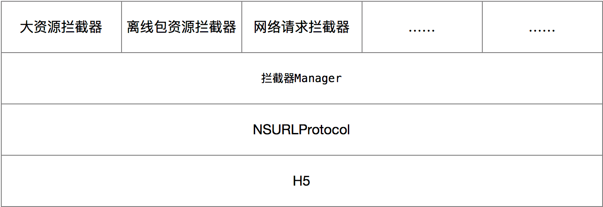

#Hybrid实现

Hybrid的实质：一个承载H5业务的壳，一条方便H5调用客户端功能的桥梁，方便H5开发的库。本身没有太多复杂的技术，但内容很杂，需要根据当前业务，用精心的设计来整合各类资源的库。

Hybrid的重点在于提供各种各样丰富的交互供H5使用，越丰富，H5所能做的事情越多，微信里面包含两百个左右的交互(硬件信息、App信息、离线包更新、生命周期、调试、路由跳转、各种原生UI控件、动画、网络、数据缓存、地图、图片、视频、视频、实时音视频、麦克风、相机、蓝牙、罗盘、陀螺仪、GPS、二维码、文件操作、登录、用户信息、支付、分享、授权…...[还有一堆])可供H5使用。

## 目录

一、[架构](#一、架构)

二、[实现](#一、实现)

​	1.[WebView](#1.WebView)

​	2.[WebViewController](#2.WebViewController)

​	3.[配置](#3.配置)

​	4.[Web路由](#4.Web路由)

​	5.[JSBridge](#5.JSBridge)

​	6.[网络拦截](#6.网络拦截)

​	7.[离线包](#7.离线包)


###一、架构

认清实质之后，我们有必要大量查阅相关的文章，对比各种开源库。为此，我开了谷歌和百度，搜索 "JS原生交互"、"WKWebVIew"、"Hybrid架构"等关键词，筛选找到以下的文章：

- [Objective-C与JavaScript交互的那些事](https://www.jianshu.com/p/f896d73c670a)  和 [续集](https://www.jianshu.com/p/939db6215436)
- [js(javascript)与ios(Objective-C)相互通信交互](http://www.skyfox.org/javascript-ios-navive-message.html)
- [深入浅出 JavaScriptCore](https://juejin.im/entry/59cde5536fb9a00a4c272e03)
- [WKWebView使用及注意点(keng)](https://www.jianshu.com/p/9513d101e582)
- [移动 H5 首屏秒开优化方案探讨](http://blog.cnbang.net/tech/3477/)
- [手机QQ Hybrid 的架构](https://mp.weixin.qq.com/s/evzDnTsHrAr2b9jcevwBzA)
- [豆瓣的混合开发框架 -- Rexxar](http://lincode.github.io/Rexxar-OpenSource)
- [Hybrid APP架构设计思路](https://segmentfault.com/a/1190000004263182)
- [基于 LocalWebServer 实现 WKWebView 离线资源加载](https://mp.weixin.qq.com/s?__biz=MjM5OTM0MzIwMQ%3D%3D&mid=2652551603&idx=3&sn=47be001d930c6f11391f43959d864afb&chksm=bcd2fcbd8ba575abd5c81b61255f49b2c2654eca45c169e3226ab743e6f4329d62924929fabe)
- [浅谈Hybrid技术的设计与实现](https://www.cnblogs.com/yexiaochai/p/4921635.html)
- [Bugly WKWebView 那些坑](https://mp.weixin.qq.com/s/rhYKLIbXOsUJC_n6dt9UfA?)
- [QQ空间面向移动时代Hybrid架构设计](https://blog.csdn.net/offbye/article/details/52369329)
- [iOS中WebKit框架应用与解析](https://www.cnblogs.com/fengmin/p/5737355.html)
- [WKWebView详解](https://cloud.tencent.com/developer/article/1033743)
- [微信JSSDK文档](https://mp.weixin.qq.com/wiki?t=resource/res_main&id=mp1421141115)
- [微信JSSDKDemo - 用手机微信打开可测试效果](http://203.195.235.76/jssdk/#menu-basic)
- [WKWebView拦截HTTP后Body被清空的讨论](https://github.com/Yeatse/NSURLProtocol-WebKitSupport/issues/1)
- [微信小程序架构分析](https://zhuanlan.zhihu.com/p/22754296)
- [让别人的小程序运行在自己的app中](https://www.jianshu.com/p/51ac882ea9f4)
- [小程序API文档](https://developers.weixin.qq.com/miniprogram/dev/api/)


通过文章找到了以下开源库：

- [JS_OC](https://github.com/Haley-Wong/JS_OC)
- [VasSonic](https://github.com/Tencent/VasSonic)
- [Hybrid](https://github.com/yexiaochai/Hybrid)
- [Rexxar](https://github.com/douban)
- [NSURLProtocol-WebKitSupport](https://github.com/Yeatse/NSURLProtocol-WebKitSupport)
- [Hera](https://weidian-inc.github.io/hera/#/)


通过阅读文章和源码，进行对比总结，各取所长，最后得出以下架构：





### 二、实现

PS：下面的代码示例大部分代码都是Swift写的，为啥不用OC，工作上的代码用OC写的，自己写个库再用OC那就太无聊了，并且换一种语言，换一种思考方式，能给自己的开发方式，思维逻辑带来更多的思考补充。

#### 1.WebView

WebView作为Hybrid的最上层，作用是展示H5的UI效果，系统提供的WebView是通用的，为了更加方便的开发和调试，我们有必要对其进行封装，这就是Hybrid的WebView层的作用。以iOS为例，建议以WKWebView为基础进行封装。


#####A.WebView Manager

WebView Manager用于全局管理WebView的创建和销毁。因为WebView的创建需要耗时0.5-1秒左右，所以需要此管理类提前创建。

```swift
class KGWebViewManager {
  //单例
	static let manager: KGWebViewManager
  
  //使用中WebView堆栈
  lazy var webViewStack: [KGWKWebView]
  
  //未使用的WebView
  var emptyWebView: KGWKWebView
  
  //创建WebView
  static func createWebView() -> KGWKWebView
  
  //预加载WebView
  static func preloadWebView()
  
  //销毁当前WebView
	static func destoryCurrentWebView()
}
```

预加载WebView：App启动完成后，预加载WebView，即创建一个WebView对象，load一个空字符串，并被KGWebViewManager.emptyWebView持有，备用，这一步的目的是初始化WebKit。

创建WebView：打开页面时，创建WebView，实质是获取已创建好的KGWebViewManager.emptyWebView并使用，然后再创建一个WebView对象，供下次打开页面使用。

销毁当前WebView：退出页面时，销毁当前WebView，即移除webViewStack的最后一个WebView，然后交由系统释放。


##### B.UI

WebView其实没有UI，除了一个Frame，但Frame交给了WebViewController处理。这里的UI实质是指网页加载的进度条。直接用UIProgressView，观察WKWebView的estimatedProgress属性即可。

除了进度条，还可以观察WKWebView的title属性，回调给WebViewController显示，这样就算JS端动态修改了网页的title也能监听到。


##### C.配置

WKWebView的配置由WKWebViewConfiguration来管理。需要注意的点有以下几个：

- WKProcessPool最好是个单例，否则不同的WebView之间无法共用缓存和Cookie

  ```swift
  private static let sharedProcessPool: WKProcessPool = WKProcessPool()
  ```

- WKUserContentController在WebView创建后无法动态修改，使用WKScriptMessageHandler进行交互需要注意这个

  ```swift
  static var defaultConfiguration: WKWebViewConfiguration {
  	let defaultConfiguration = WKWebViewConfiguration()
          
  	if #available(iOS 10.0, *) {
  		defaultConfiguration.mediaTypesRequiringUserActionForPlayback = .all
    }
    if #available(iOS 9.0, *) {
    	defaultConfiguration.requiresUserActionForMediaPlayback = false
      defaultConfiguration.websiteDataStore = WKWebsiteDataStore.default()
    }
          
    defaultConfiguration.allowsInlineMediaPlayback = true
    defaultConfiguration.processPool = sharedProcessPool
          
    defaultConfiguration.userContentController = WKUserContentController()        
    return defaultConfiguration
  }
  
  let webView = KGWKWebView(frame: CGRect.zero, configuration: defaultConfiguration)
  ```

- WKDataDetectorTypes不建议设置，否则很容易出现把数字识别为电话号码的情况

- **UserAgent**，这个**很重要很重要很重要**，这个属性是WKWebView的，用来自定义浏览器标识了，建议设置此属性，让H5知道自己当前是运行在哪个App上面。使用UIWebView可以同步获取到浏览器的原始UA，UA自定义建议：在原始的UA后面拼接App标识和App版本号，H5可根据此标识来对代码进行兼容。

  ```swift
  static var originalUserAgent: String {
  	let webview = UIWebView(frame: CGRect.zero)
    let userAgent = webview.stringByEvaluatingJavaScript(from: "navigator.userAgent")
    return userAgent ?? ""
  }
  
  KGWKWebViewObj.customUserAgent = originalUserAgent + customUserAgent
  ```

  这样设置之后，在JS端就能用`navigator.userAgent`来判断当前H5运行在哪个App上了。

  

##### D.UI Delegate

UI Delegate指WKUIDelegate，主要是处理H5的弹框，iframe页面的显示，自动弹起键盘等。无技术性可言，可以写死。

**弹框**，建议使用add在window上面的UIAlertView或者自定义的add在window上面的AlertView，可以防止跳转过程中H5弹框造成的闪退。

```swift
// MARK: - WKUIDelegate
extension KGWKWebView: WKUIDelegate {
    
    public func webView(_ webView: WKWebView, runJavaScriptAlertPanelWithMessage message: String, initiatedByFrame frame: WKFrameInfo, completionHandler: @escaping () -> Void) {
        
        let alert = UIAlertView(title: nil, message: message, delegate: self, cancelButtonTitle: "好的")
        alert.tag = 1000
        alert.show()
        
        alertCompletionHandler = completionHandler
    }
    
    public func webView(_ webView: WKWebView, runJavaScriptConfirmPanelWithMessage message: String, initiatedByFrame frame: WKFrameInfo, completionHandler: @escaping (Bool) -> Void) {
        
        let alert = UIAlertView(title: "", message: message, delegate: self, cancelButtonTitle: "取消", otherButtonTitles: "确认")
        alert.tag = 1001
        alert.show()
        
        confirmCompletionHandler = completionHandler
    }
    
    public func webView(_ webView: WKWebView, runJavaScriptTextInputPanelWithPrompt prompt: String, defaultText: String?, initiatedByFrame frame: WKFrameInfo, completionHandler: @escaping (String?) -> Void) {
        
        let alert = UIAlertView(title: "", message: prompt, delegate: self, cancelButtonTitle: "取消", otherButtonTitles: "确认")
        alert.alertViewStyle = .plainTextInput
        alert.tag = 1002
        alert.show()

        textCompletionHandler = completionHandler
    }
    
}


extension KGWKWebView: UIAlertViewDelegate {
    
    public func alertView(_ alertView: UIAlertView, clickedButtonAt buttonIndex: Int) {
        switch alertView.tag {
        case 1000:
            if let completionHandler = alertCompletionHandler, buttonIndex == alertView.cancelButtonIndex {
                completionHandler()
                alertCompletionHandler = nil
            }
            
        case 1001:
            if let completionHandler = confirmCompletionHandler {
                if buttonIndex == alertView.cancelButtonIndex {
                    completionHandler(false)
                }
                else {
                    completionHandler(true)
                }
                confirmCompletionHandler = nil
            }
            
        case 1002:
            if let completionHandler = textCompletionHandler {
                if buttonIndex == alertView.cancelButtonIndex {
                    completionHandler(nil)
                }
                else {
                    let textField = alertView.textField(at: 0)
                    completionHandler(textField?.text)
                }
                textCompletionHandler = nil
            }
            
        default:
            
            break
        }
    }
    
}
```

**iframe页面的显示**

```swift
public func webView(_ webView: WKWebView, createWebViewWith configuration: WKWebViewConfiguration, for navigationAction: WKNavigationAction, windowFeatures: WKWindowFeatures) -> WKWebView? {
    if navigationAction.targetFrame == nil {
        webView.load(navigationAction.request)
    }
    return nil
}
```

**自动弹起键盘**

```swift
typealias ClosureType =  @convention(c) (Any, Selector, UnsafeRawPointer, Bool, Bool, Any) -> Void

extension KGWKWebView {
    
    var allowDisplayingKeyboardWithoutUserAction: Bool {
        get {
            return false
        } set {
            if newValue == true {
                setKeyboardRequiresUserInteraction()
            }
        }
    }
    
    func setKeyboardRequiresUserInteraction() {
        var selStr = ""
        if #available(iOS 11.3, *) {
            //"_startAssistingNode:userIsInteracting:blurPreviousNode:changingActivityState:userObject:"
            selStr = "X3N0YXJ0QXNzaXN0aW5nTm9kZTp1c2VySXNJbnRlcmFjdGluZzpibHVyUHJldmlvdXNOb2RlOmNoYW5naW5nQWN0aXZpdHlTdGF0ZTp1c2VyT2JqZWN0Og=="
        }
        else {
            //"_startAssistingNode:userIsInteracting:blurPreviousNode:userObject:"
            selStr = "X3N0YXJ0QXNzaXN0aW5nTm9kZTp1c2VySXNJbnRlcmFjdGluZzpibHVyUHJldmlvdXNOb2RlOnVzZXJPYmplY3Q6"
        }
        selStr = selStr.kg.base64DecodedString
        let sel: Selector = sel_getUid(selStr)
        let WKContentView: AnyClass = NSClassFromString("WKContentView")!
        let method = class_getInstanceMethod(WKContentView, sel)
        let originalImp: IMP = method_getImplementation(method!)
        let original: ClosureType = unsafeBitCast(originalImp, to: ClosureType.self)
        let block : @convention(block) (Any, UnsafeRawPointer, Bool, Bool, Any) -> Void = {(me, arg0, arg1, arg2, arg3) in
            original(me, sel, arg0, true, arg2, arg3)
        }
        let imp: IMP = imp_implementationWithBlock(block)
        method_setImplementation(method!, imp)
    }
    
}
```


##### E.URL Delegate

URL Delegate指WKNavigationDelegate，是加载H5页面的过程中系统的回调。由于WKNavigationDelegate的命名没有UIWebViewDelegate的友好，WKNavigationDelegate的回调信息比较多，但我们所需要的信息不要这么详细，所以建议在这里把Delegate转一层，再抛出去给WebViewController处理。

定义：

```swift
protocol KGWebViewDelegate: NSObjectProtocol {
    
    func webView(_ webView: KGWKWebView, shouldStartLoadWith request: URLRequest, navigationType: WKNavigationType) -> Bool
    
    func webViewDidStartLoad(_ webView: KGWKWebView)
    
    func webViewDidFinishLoad(_ webView: KGWKWebView)
    
    func webView(_ webView: KGWKWebView, didFailLoadWithError error: Error)
    
    func webViewDidTerminate(_ webView: KGWKWebView)
    
    func webViewTitleChange(_ webView: KGWKWebView)
    
}
```

实现：

```swift
extension KGWKWebView: WKNavigationDelegate {
    
    public func webView(_ webView: WKWebView, decidePolicyFor navigationAction: WKNavigationAction, decisionHandler: @escaping (WKNavigationActionPolicy) -> Void) {
        guard let allowed = webViewDelegate?.webView(self, shouldStartLoadWith: navigationAction.request, navigationType: navigationAction.navigationType) else {
            decisionHandler(.allow)
            return
        }
        
        decisionHandler(allowed ? .allow : .cancel)
    }
    
    public func webView(_ webView: WKWebView, didStartProvisionalNavigation navigation: WKNavigation!) {
        webViewDelegate?.webViewDidStartLoad(self)
    }
    
    public func webView(_ webView: WKWebView, didFinish navigation: WKNavigation!) {
        webViewDelegate?.webViewDidFinishLoad(self)
    }
    
    public func webView(_ webView: WKWebView, didFailProvisionalNavigation navigation: WKNavigation!, withError error: Error) {
        webViewDelegate?.webView(self, didFailLoadWithError: error)
    }
    
    public func webView(_ webView: WKWebView, didFail navigation: WKNavigation!, withError error: Error) {
        webViewDelegate?.webView(self, didFailLoadWithError: error)
    }
    
    public func webViewWebContentProcessDidTerminate(_ webView: WKWebView) {
        webViewDelegate?.webViewDidTerminate(self)
    }
    
    public func webView(_ webView: WKWebView, didReceive challenge: URLAuthenticationChallenge, completionHandler: @escaping (URLSession.AuthChallengeDisposition, URLCredential?) -> Void) {
        if challenge.protectionSpace.authenticationMethod == NSURLAuthenticationMethodServerTrust && challenge.previousFailureCount == 0 {
            let credential = URLCredential(trust: challenge.protectionSpace.serverTrust!)
            return completionHandler(.useCredential, credential)
        }
        if challenge.protectionSpace.authenticationMethod == NSURLAuthenticationMethodClientCertificate {
            return completionHandler(.performDefaultHandling, nil)
        }
        return completionHandler(.cancelAuthenticationChallenge, nil)
    }
    
}
```

这里后续会开放更多的Delegate，因为有更多需要自定义的情况，比如很多时候查看附件乱码需要处理的情况，HTTPS证书校验等需要特殊定制化的业务逻辑。


#### 2.WebViewController

WebViewController作为Hybrid的中间层，作用是协调Hybrid各部分功能完成的工作。




##### A.入口

入口即客户端打开WebViewController时的初始化方法，除了传入URL之外，还需要传入Header，由于WKWebView不支持POST请求，所以不必考虑body的问题，而且一般来说，网页资源都是GET请求。但是URL中经常存在占位符替换的情况，所以最终将入口的API设计为

```swift
public convenience init(urlString: String, parameters: [String: String]? = nil, headerFields: [String: String]? = nil)
```

parameters参数就是用来满足这个占位符替换的需求的

```swift
假设url为https://www.xxx.com?token={token}
只要将parameters设为["{token}": "12345"]
url即可替换为https://www.xxx.com?token=12345
```


##### B.对外Delegate

对外Delegate是把WKNavigationDelegate开放给外面业务层去处理一些逻辑，比如错误页，埋点等。

```swift
public protocol KGWebViewControllerDelegate: NSObjectProtocol {
    
    func webViewController(_ webViewController: KGWebViewController, shouldStartLoadWith request: URLRequest, navigationType: WKNavigationType) -> Bool
    
    func webViewControllerDidStartLoad(_ webViewController: KGWebViewController)

    func webViewControllerDidFinishLoad(_ webViewController: KGWebViewController)

    func webViewControllerDidFailLoad(_ webViewController: KGWebViewController)

}
```


##### C.UI

WebViewController的UI主要是WebView和导航栏的UI。

WebView的UI还好，只要判断一下，是否存在导航栏或者TabBar，然后控制一下frame就行了。

导航栏的话，建议学下微信，不要开放过多的UI控制，否则维护起来非常麻烦，一般就开放一下title，背景色，前景色的控制就好了。如果再开放导航栏的隐藏显示，沉浸式导航栏，导航栏item的自定义等，那真的是一场灾难，维护起来非常麻烦，产品经理笑了，你却哭了。


##### D.生命周期

WebViewController的生命周期与ViewController的生命周期是一样的，但WebViewController的生命周期里，要完成很多事情，包括保存和恢复上一个页面的导航栏状态(iOS的特殊性，系统的导航栏被一个堆栈的ViewControllers共用)、初始化界面、判断比否离线包、执行离线包更新逻辑、开启拦截器、初始化Web路由、注册JS交互、加载网页、将生命周期事件通知H5等。

```swift
public convenience init(urlString: String, parameters: [String: String]? = nil, headerFields: [String: String]? = nil) {
    self.init()
    webRoute = KGWebRoute(urlString: urlString, parameters: parameters, headerFields: headerFields)
    webRoute?.config = config
}

override public func viewDidLoad() {
    super.viewDidLoad()
    KGLog(title: "ViewDidLoad", self)
    
    storeOriginUI()
    navigationItem.titleView = titleView
    view.backgroundColor = UIColor.white
    
    setup()
}

override public func viewWillAppear(_ animated: Bool) {
    super.viewWillAppear(animated)
    changeToCurrentUI()
    if webView?.url == nil || webView?.url?.absoluteString == "about:blank" {
        setup()
    }
}

override public func viewDidAppear(_ animated: Bool) {
    super.viewDidAppear(animated)
    
}

override public func viewWillDisappear(_ animated: Bool) {
    super.viewWillDisappear(animated)
    resetToOriginUI()
}

override public func viewDidDisappear(_ animated: Bool) {
    super.viewDidDisappear(animated)
    
    navigationController?.interactivePopGestureRecognizer?.isEnabled = true
    removeNotification()
}

public override func viewDidLayoutSubviews() {
    super.viewDidLayoutSubviews()
    
    guard let webView = webView else { return }
    var navigationBarHeight: CGFloat = 0
    var tabbarHeight: CGFloat = 0
    
    if let navigationController = navigationController, navigationController.navigationBar.frame.maxY > 20 {
        navigationBarHeight = navigationController.navigationBar.frame.maxY
    }
    
    if let count = navigationController?.viewControllers.count, count == 1, let tabBar = tabBarController?.tabBar, tabBar.isHidden == false {
        tabbarHeight = tabBar.frame.height
    }
    
    var frame = webView.frame
    frame.origin.y = navigationBarHeight
    frame.size.height = UIScreen.kg.height - navigationBarHeight - tabbarHeight
    webView.frame = frame
}
```


##### E.实现WebView的Delegate

主要是处理url加载过程中的逻辑、把生命周期提供给H5、将Delegate再抛一层到外面业务层做业务处理。

```swift
// MARK: - KGWebViewDelegate
extension KGWebViewController: KGWebViewDelegate {
    
    func webView(_ webView: KGWKWebView, shouldStartLoadWith request: URLRequest, navigationType: WKNavigationType) -> Bool {
        guard let url = request.url, let scheme = url.scheme else { return false }
        
        KGLog(title: "ShouldStart:", url.absoluteString)
        
        if scheme.kg.isHTTP || scheme.kg.isFile {
            if navigationType != .reload {
                if isUnload(webView, shouldStartLoadWith: request, navigationType: navigationType) {
                    onUnload()
                }
                else {
                    onHide()
                }
            }
        }
        
        if let adelegate = delegate {
            return adelegate.webViewController(self, shouldStartLoadWith: request, navigationType: navigationType)
        }
        if let adelegate = KGWebViewController.delegate {
            return adelegate.webViewController(self, shouldStartLoadWith: request, navigationType: navigationType)
        }
        
        return true
    }
    
    func webViewDidStartLoad(_ webView: KGWKWebView) {
        
        KGWebViewController.delegate?.webViewControllerDidStartLoad(self)
        delegate?.webViewControllerDidStartLoad(self)
    }
    
    func webViewDidFinishLoad(_ webView: KGWKWebView) {
        
        if config.injectDynamically == false {
            onReady()
        }
        
        onShow()
        
        KGWebViewController.delegate?.webViewControllerDidFinishLoad(self)
        delegate?.webViewControllerDidFinishLoad(self)
    }
    
    func webView(_ webView: KGWKWebView, didFailLoadWithError error: Error) {
        KGLog(title: "didFailLoad:", error)
        
        let nsError = error as NSError
        if nsError.code == 102 || nsError.code == 204 { return }
        if let urlError = error as? URLError, urlError.code == .cancelled { return }

        if let url = webView.url, url.isFileURL,
           let forwardItemScheme = webView.backForwardList.forwardItem?.url.scheme, forwardItemScheme.kg.isHTTP,
           let filePath = webView.url?.absoluteString.kg.noScheme, FileManager.kg.fileExists(atPath: filePath) {
            return reloadWebView()
        }
        
        KGWebViewController.delegate?.webViewControllerDidFailLoad(self)
        delegate?.webViewControllerDidFailLoad(self)
    }
    
    func webViewDidTerminate(_ webView: KGWKWebView) {
        setup()
    }
    
    func webViewTitleChange(_ webView: KGWKWebView) {
        title = webView.title
    }
    
}
```

提供生命周期后，H5可对页面加载的生命周期进行监听

```javascript
wx.onReady = function () {
	//加载完成
}

wx.onShow = function () {
	//页面回到前台
}

wx.onHide = function () {
	//页面进入后台
}

wx.onUnload = function () {
	//页面销毁
}
```


除此之外，WebViewController还得实现UIScrollViewDelegate，否则滚动的效果很奇怪，且只能在WebViewController中去实现，我尝试过在WebView中去实现，会导致闪退，忘记原因了。

```swift
extension KGWebViewController: UIScrollViewDelegate {
    
    private func scrollViewWillBeginDragging(_ scrollView: UIScrollView) {
        scrollView.decelerationRate = .normal
    }
    
}

func deinitWebView() {
		guard let webView = webView else { return }
		webView.scrollView.delegate = nil
}
```


#### 3.配置

一个三方库运行于App中，往往需要各种各样的个性化配置，如何提供更好的配置方式，这是这部分功能需要考虑的东西。Hybrid对于App开发者来说，就是一个WebViewController，主要需要的配置有UI配置：界面风格的配置(普通风格，小程序风格)、导航栏的配置、进度条的配置；WebView配置：userAgent、请求配置等。同时这些配置还需要支持全局配置和个别配置(优先级高)等要求。


```swift
public struct KGGlobalConfig {
    
    public static var injectDynamically: Bool = false
    
    public static var userAgent: String?
    
    public static var cachePolicy: URLRequest.CachePolicy = .useProtocolCachePolicy
    
    public static var timeoutInterval: TimeInterval = 60
    
    public static var progressTintColor: UIColor = UIColor(red:0.59, green:0.78, blue:0.45, alpha:1.00)

    public static var barBackgroundColor: UIColor = UIColor(hexString: "#ffffff")!
    
    public static var barFrontColor: UIColor = UIColor(hexString: "#000000")!
    
}
```


#### 4.Web路由

用户从入口传入URL等信息后，需要经过一系列的处理后，最终变成一个可供WebView加载的URLRequest，且网页跳转后，需要记录当前网页加载的url，这部分工作由Web路由来完成。


```swift
func formatURLRequest() -> URLRequest? {
        guard let urlString = storeURLString else { return nil }
        var formatUrl: String = urlString
        if let params = storeParameters {
            for (key, obj) in params {
                formatUrl = formatUrl.replacingOccurrences(of: key, with: obj)
            }
        }
        
        //url is invalid: contain chinese
        if URL(string: formatUrl) == nil {
            formatUrl = formatUrl.kg.urlEncode
        }
        
        if let url = URL(string: formatUrl) {
            var request = URLRequest(url: url)
            request.allHTTPHeaderFields = storeHeaderFields
            request.timeoutInterval = config.timeoutInterval
            request.cachePolicy = config.cachePolicy
            return request
        }
        
        return nil
    }
```


#### 5.JSBridge

JSBridge是Hybrid的核心，作用是提供JS与客户端通讯的桥梁。能够让JS与客户端通讯的方式有一下几种：

1.iOS(JavaScriptCore)和Android(JavaScriptInterface)

2.iframe请求

3.iOS(WebKit PostMessage)

4.alert、confirm、prompt(不建议)


JavaScriptCore是可以让JS独立于WebView之外运行的一个JS环境，React Native，Weex，小程序等都是基于它实现，JavaScriptCore能实现很多其他通讯方式无法实现的功能，但是WKWebView无法使用，除非像小程序那样，将JS分离出来，否则无法使用。

万幸iframe、WebKit PostMessage都可以使用，简单封装一个JSBridge，使iOS和Android统一调用即可。

一个标准的交互流程如图：


一个JSBridge的封装大概如此：

```javascript
;(function () {
  	//判断Bridge对象是否存在
    if (window.KGJSBridge) {
        return
    }

    if (!window.onerror) {
        window.onerror = function(msg, url, line) {
            console.log('JSBridge: ERROR:' + msg + '@' + url + ':' + line)
        }
    }

    window.KGJSBridge = {
        registerHandler: registerHandler,
        callHandler: callHandler,
        _subscribeHandler: _subscribeHandler
    };

    var messageHandlers = {}
		
    //暂存发起交互的回调，接收到客户端的固定回调之后，调用相应的回调
    var responseCallbacks = {}

    var uniqueId = 1

    function registerHandler(handlerName, handler) {
        messageHandlers[handlerName] = handler
    }

    function callHandler(handlerName, data, responseCallback) {
        if (arguments.length == 2 && typeof data == 'function') {
            responseCallback = data
            data = null
        }
        _doSend({ handlerName:handlerName, data:data }, responseCallback)
    }

    function _doSend(message, responseCallback) {
        if (responseCallback) {
            var callbackId = 'cb_' + (uniqueId++) + '_' + new Date().getTime()
            responseCallbacks[callbackId] = responseCallback
            message['callbackId'] = callbackId
        }

        _postMessage(message)
    }

  	//webkit post message
    function _postMessage(message) {
        if (window.invokeHandler) {
            window.invokeHandler.postMessage(JSON.stringify(message))
        }
        else {
            window.webkit.messageHandlers.invokeHandler.postMessage(message)
        }
    }
		
  	//客户端回调时调用的固定方法，会带上callbackId来分辨是哪个交互的回调
    function _subscribeHandler(messageJSON) {
        var message = JSON.parse(messageJSON)
        var responseCallback

        if (message.responseId) {
            responseCallback = responseCallbacks[message.responseId]
            if (!responseCallback) {
                return
            }

            responseCallback(message.responseData)
            delete responseCallbacks[message.responseId]
        }
        else {
            if (message.callbackId) {
                var callbackResponseId = message.callbackId
                responseCallback = function (responseData) {
                    _doSend({
                        handlerName: message.handlerName,
                        responseId: callbackResponseId,
                        responseData: responseData
                    })
                }
            }

            var handler = messageHandlers[message.handlerName]
            if (handler) {
                handler(message.data, responseCallback)
            }
            else {
                console.log('JSBridge: WARNING: no handler for message from Native:', message)
                responseCallback({code: -1, message: 'No Api:' + message.handlerName + '!'})
            }
        }
    }

    function _toAbsURL(url){
        var a = document.createElement('a');
        a.href = url;
        return a.href;
    };

    const Code = {
        success: 200,
        cancel: -999,
        unknown: 404,
    }

    window.wx = {}

    wx.invokeHandler = function(path, object) {
        object = object || {}
        var obj = JSON.parse(JSON.stringify(object))
        delete obj.complete
        delete obj.success
        delete obj.cancel
        delete obj.unknown
        delete obj.fail

        callHandler(path, obj, function (res) {
            res.data = res.data || {}
            if (res.code == Code.success) {
                res.data.errMsg = path + ':ok'
                object.success && object.success(res.data)
            }

            else if (res.code == Code.cancel) {
                res.data.errMsg = path + ':' + res.message
                object.cancel && object.cancel(res.data)
            }

            else if (res.code == Code.unknown) {
                res.data.errMsg = path + ':' + res.message
                object.unknown && object.unknown(res.data)
            }

            else {
                res.data.errMsg = path + ':' + res.message
                object.fail && object.fail(res.data)
            }

            delete res.message
            object.complete && object.complete(res.data)
        })
    }

    wx.subscribeHandler = function(path, callback) {
        registerHandler(path, function (data, resCallback) {
            data = data || {}
            data.callback = resCallback
            callback && callback(data)
        })
    }
})();
```


由于JSBridge的主要目的是让JS调用客户端功能，对于JS端来说，客户端功能可看做是客户端提供的接口，所以可以将此模块命名为NativeApi。所以一个完整的交互模块，包含以下功能。


系统提供的与JS通信的方法都在WebView的Delegate中，比如：

WKScriptMessageHandler

```swift
public func userContentController(_ userContentController: WKUserContentController, didReceive message: WKScriptMessage) {
	//message.body为JS传递过来的消息
}
```

iframe

```swift
public func webView(_ webView: WKWebView, decidePolicyFor navigationAction: WKNavigationAction, decisionHandler: @escaping (WKNavigationActionPolicy) -> Void) {
	//navigationAction.request.URL为JS传递过来的消息
	decisionHandler(.allow)
}
```

在使用的过程中，如果不加以限制，经常会出现在WebView中耦合了大量的JS交互处理代码，比如：

```swift
public func webView(_ webView: WKWebView, decidePolicyFor navigationAction: WKNavigationAction, decisionHandler: @escaping (WKNavigationActionPolicy) -> Void) {
	let url = navigationAction.request.URL
	
  if let scheme = url.scheme, scheme == "myScheme", let path = url.path {
  	
    switch path {
      
      case "systemInfo"
      	//一堆逻辑
      case "lifeCycle"
      	//一堆逻辑
      case "route"
      	//一堆逻辑
      case "ui"
      	//一堆逻辑
      case "......"
      	//一堆逻辑
    }
    
    decisionHandler(.cancel)
  }
	
	decisionHandler(.allow)
}
```

如何解决这种尴尬的情况呢？由以上代码可知，一个交互功能主要分成path(功能接口名)和功能逻辑，一个大型的Hybrid App可能包含几十个交互。

因此我们需要一个交互管理类将这些功能管理起来，这个管理类即是WebView的Delegate的实现者，管理类提供方法给外部交互类注册。

交互类则主要有两个方法，一个是path，一个是功能实现方法。

交互类将自己注册到管理中，当交互管理类接收到JS消息时，会根据传过来的path寻找已注册的具体交互类，然后调用其实现方法，将具体消息分发过去，交互类执行完逻辑后，回调给交互管理类，交互管理类再回调给JS即可。

梳理后的代码如下：

```swift
public func webView(_ webView: WKWebView, decidePolicyFor navigationAction: WKNavigationAction, decisionHandler: @escaping (WKNavigationActionPolicy) -> Void) {
	let url = navigationAction.request.URL
	
  if let scheme = url.scheme, scheme == "myScheme", let path = url.path {
  	
    let api = apiDict[path]
    api.perform(with parameters) { responseData
    	//response to js
    }
    
    decisionHandler(.cancel)
  }
	
	decisionHandler(.allow)
}
```

这样，交互逻辑就可以解耦为一个个类，每个类负责不同的交互行为。

```swift
class SystemInfo: NativeApiDelegate {
  
  var path: String { retrume "systemInfo" }
  
  func perform(with parameters: [String : Any]?, complete: @escaping (KGNativeApiResponse) -> Void) {
		//执行具体逻辑
    
    complete()//回调
  }
}
```

然后就像砌砖一样，把一个个交互功能实现就好。不知道协议如何定义好，大家有不同的想法？遇到这种问题，一般推荐的做法是参考业内走在最前的厂商去做，比如[小程序API文档](<https://developers.weixin.qq.com/miniprogram/dev/api/>)，文档都不用写了，跟着实现就行。


如果不需要更高级的特性和优化，只要做到这一步，这就是一个比较完整的Hybrid框架了。


#### 6.网络拦截

如果不开启网络拦截，一般我们只能拦截到H5跳转时的加载请求，开启了网络拦截之后，我们能够接管H5的所有HTTP请求，包括静态资源和XHR请求等，由于这个特性，我们可以用网络拦截来实现很多有意思的功能。比如传输大文件，网络请求转发和离线包等。

网络拦截在iOS里面使用NSURLProtocol去实现的，WKWebView不支持NSURLProtocol，但我们可以通过私有API的形式去实现。

```swift
extension KGNamespace where Base == URLProtocol {
    
    //browsingContextController
    static private let KGContextController: AnyObject = type(of: WKWebView().value(forKey: "YnJvd3NpbmdDb250ZXh0Q29udHJvbGxlcg==".kg.base64DecodedString) as AnyObject)

    //registerSchemeForCustomProtocol
    static private let KGRegistScheme: Selector = NSSelectorFromString("dW5yZWdpc3RlclNjaGVtZUZvckN1c3RvbVByb3RvY29sOg==".kg.base64DecodedString)
    
    //unregisterSchemeForCustomProtocol
    static private let KGUnregistScheme: Selector = NSSelectorFromString("cmVnaXN0ZXJTY2hlbWVGb3JDdXN0b21Qcm90b2NvbDo=".kg.base64DecodedString)
    
    func regist(scheme: String) {
        let cls: AnyObject = Base.kg.KGContextController
        let sel: Selector = Base.kg.KGRegistScheme
        if cls.responds(to: sel) {
            let _ = cls.perform(sel)
        }
    }
    
    func unregist(scheme: String) {
        let cls: AnyObject = Base.kg.KGContextController
        let sel: Selector = Base.kg.KGUnregistScheme
        if cls.responds(to: sel) {
            let _ = cls.perform(sel)
        }
    }
        
}
```


由于一个Hybrid框架中可能存在多个拦截器，且各自的开启和关闭时机不同，同时又因为WKWebView中开启网络拦截会导致POST请求的body被清空，拦截器不及时关闭会导致H5的POST请求被清空，所以我们需要一个拦截器管理类来对一系列的拦截器进行管理，并负责开启和关闭。拦截器管理类和交互管理类的设计差不多，都是一个管理类+N个执行类，执行类注册到管理类中，管理类负责将各种之间通过Delegate分发到执行类中，执行类处理完后回调给管理类，管理类再与底层进行通信。




拦截器管理类代码，这里设计了一个计数器，模拟ARC的方式，对拦截器的开启和关闭进行管理。比如大资源拦截器是在用户选择完资源后进行开启的，H5端接收到资源后关闭，就在对应的地方开启和关闭就行，重复开启或关闭只会增加或减少计数，当计数为0时自动关闭，避免了不及时关闭造成的bug。

```objective-c
static NSInteger SHInterceptorCounter = 0;
static NSMutableDictionary<NSString *, SHInterceptor<SHInterceptorDelegate> *> *SHInterceptorDict = nil;

@interface SHInterceptorManager ()

@property (nonatomic, strong) SHInterceptor<SHInterceptorDelegate> *workInterceptor;

@end

@implementation SHInterceptorManager

#pragma mark - Init

+ (void)addInterceptor:(SHInterceptor<SHInterceptorDelegate> *)interceptor {
    if ([interceptor respondsToSelector:@selector(canInitWithRequest:)] == false) { return; }
    
    NSString *className = NSStringFromClass(interceptor.class);
    self.interceptorDict[className] = interceptor;
}

+ (void)start {
    if (self.interceptorDict.count == 0) { return; }
    if (SHInterceptorCounter <= 0) {
        SHInterceptorCounter = 0;
        [NSURLProtocol sh_registerScheme:@"http"];
        [NSURLProtocol sh_registerScheme:@"https"];
        [NSURLProtocol registerClass:SHInterceptorManager.class];
    }
    SHInterceptorCounter++;
}

+ (void)stop {
    if (self.interceptorDict.count == 0) { return; }
    SHInterceptorCounter--;
    if (SHInterceptorCounter <= 0) {
        SHInterceptorCounter = 0;
        [NSURLProtocol sh_unregisterScheme:@"http"];
        [NSURLProtocol sh_unregisterScheme:@"https"];
        [NSURLProtocol unregisterClass:SHInterceptorManager.class];
    }
}

#pragma mark - URLProtocol

+ (BOOL)canInitWithRequest:(NSURLRequest *)request {
    // 请求不是来自浏览器，不处理
    if ([request.allHTTPHeaderFields[@"User-Agent"] hasPrefix:@"Mozilla"] == NO) {
        return NO;
    }
    __block BOOL result = NO;
    [self.interceptorDict enumerateKeysAndObjectsUsingBlock:^(NSString * _Nonnull key, SHInterceptor<SHInterceptorDelegate> * _Nonnull obj, BOOL * _Nonnull stop) {
        if ([obj respondsToSelector:@selector(canInitWithRequest:)] && [obj canInitWithRequest:request]) {
            result = YES;
            *stop = YES;
        }
    }];
    return result;
}

+ (NSURLRequest *)canonicalRequestForRequest:(NSURLRequest *)request {
    return request;
}

- (void)startLoading {
    if ([self.workInterceptor respondsToSelector:@selector(startLoadingWith:completionHandler:)]) {
        [self.workInterceptor startLoadingWith:self.request completionHandler:^(NSData * _Nullable data, NSURLResponse * _Nullable response, NSError * _Nullable error) {
            if (error) {
                [self.client URLProtocol:self didFailWithError:error];
            } else {
                [self.client URLProtocol:self didReceiveResponse:response cacheStoragePolicy:NSURLCacheStorageNotAllowed];
                [self.client URLProtocol:self didLoadData:data];
                [self.client URLProtocolDidFinishLoading:self];
            }
        }];
    }
}

- (void)stopLoading {
    if ([self.workInterceptor respondsToSelector:@selector(stopLoading:)]) {
        [self.workInterceptor stopLoading:self.request];
    }
}

#pragma mark - Get

+ (NSMutableDictionary<NSString *, SHInterceptor<SHInterceptorDelegate> *> *)interceptorDict {
    if (!SHInterceptorDict) {
        SHInterceptorDict = [NSMutableDictionary dictionary];
    }
    
    return SHInterceptorDict;
}

- (SHInterceptor<SHInterceptorDelegate> *)workInterceptor {
    __block SHInterceptor<SHInterceptorDelegate> *interceptor = nil;
    [self.class.interceptorDict enumerateKeysAndObjectsUsingBlock:^(NSString * _Nonnull key, SHInterceptor<SHInterceptorDelegate> * _Nonnull obj, BOOL * _Nonnull stop) {
        if ([obj canInitWithRequest:self.request]) {
            interceptor = obj;
            *stop = YES;
        }
    }];
    return interceptor;
}

@end
```


**传输大文件拦截器**

通常网页获取客户端的图片和视频，一般都是通过转成base64的方式通过JSBridge进行传输，但由于JSBridge传输到H5是在主线程进行的，如果文件过大，会出现异常卡顿的情况。

网络拦截可用于客户端与H5之间传输大文件，比如图片视频等，如果通过JSBridge在主线程操作，会导致页面很卡，且传输效率低。使用网络拦截并模拟服务器返回大文件资源，即可完成此步骤。

例如：选择视频

```swift
class KGChooseVideoApi: KGNativeApi, KGNativeApiDelegate, TZImagePickerControllerDelegate {
    
    var path: String { return "chooseVideo" }
    
    func perform(with parameters: [String : Any]?, complete: @escaping (KGNativeApiResponse) -> Void) {
        
        //拍摄或选择视频后，暂存于临时目录中，并返回一个临时路径
      	complete(tempPath)//https://host/base64(filePath)
        
    }
}
```

然后在JSSDK用XHR发起一个请求

```javascript
function getImageData() {
    let file = res.data
    const request = new XMLHttpRequest()
    let timeout = false
    let timer = setTimeout(() => {
        timeout = true
        request.abort
    }, 30*1000)
    if (opts.resType == 'blob') {
        request.responseType = 'blob'
    }
    request.open('GET', file.tempFilePath + `?videoType=${opts.resType || 'base64'}`, true)
    request.onreadystatechange = function() {
        if (request.readyState !== 4) return
            if (timeout) return
                clearTimeout(timer)
                if (request.status === 200) {
                    if (opts.resType == 'blob') {
                        res.data.data = window.URL.createObjectURL(request.response)
                    }
                    else {
                        res.data.data = request.response
                    }
                    
                    callback &&
                    callback(res)
                } else {
                    
                }
    }
    request.send()
}
```

客户端写一个拦截器进行处理

```objective-c
static NSString * const kSHImageTypeBlob = @"imageType=blob";
static NSString * const kSHVideoTypeBlob = @"videoType=blob";

@implementation SHFileInterceptor

- (BOOL)canInitWithRequest:(nonnull NSURLRequest *)request {
    if ([request.URL.host isEqualToString:SHFileInterceptorKey]) {
        return YES;
    }
    return NO;
}

- (void)startLoadingWith:(nonnull NSURLRequest *)request completionHandler:(nonnull void (^)(NSData * _Nullable, NSURLResponse * _Nullable, NSError * _Nullable))completionHandler {
    NSString *name = request.URL.lastPathComponent;
    NSString *filePath = [[self directory] stringByAppendingString:name];
    
    NSMutableDictionary<NSString *, NSString *> *headerFields = [NSMutableDictionary<NSString *, NSString *> dictionary];
    headerFields[@"Access-Control-Allow-Origin"] = @"*";
    headerFields[@"Access-Control-Allow-Headers"] = @"Origin, X-Requested-With, Content-Type";
    if ([request.URL.query containsString:kSHImageTypeBlob]) {
        headerFields[@"Content-Type"] = @"image/jpeg";
    }
    else if ([request.URL.query containsString:kSHVideoTypeBlob]) {
        headerFields[@"Content-Type"] = @"video/mp4";
    }
    else {
        headerFields[@"Content-Type"] = request.allHTTPHeaderFields[@"Accept"];
    }
    
    NSInteger statusCode = [[NSFileManager defaultManager] fileExistsAtPath:filePath] ? 200 : 404;
    NSHTTPURLResponse *httpResponse = [[NSHTTPURLResponse alloc] initWithURL:request.URL statusCode:statusCode HTTPVersion:nil headerFields:headerFields];
    NSError *error = statusCode == 404 ? [NSError sh_errorWithCode:statusCode message:@"File Not found."] : nil;
    NSData *data = [NSData dataWithContentsOfFile:filePath];
    
    //判断URL的query中是否包含imageType=blob，否则返回base64
    if (![request.URL.query containsString:kSHImageTypeBlob] && ![request.URL.query containsString:kSHVideoTypeBlob]) {
        NSString *base64String = SUSafeString(data.base64EncodedString);
        data = [base64String dataUsingEncoding:NSUTF8StringEncoding];
    }
    
    completionHandler(data, httpResponse, error);
}

- (void)stopLoading:(NSURLRequest *)request {
    [SHInterceptorManager stop];
}

- (NSString *)directory {
    return [NSString stringWithFormat:@"%@/tmp/", NSHomeDirectory()];
}

@end
```

这样H5的业务层就能在无感知的情况下获取一个本地的大文件资源了，且速度非常快，不卡主线程。


**网络转发**和**离线包**

请看第7部分


#### 7.离线包

离线包的实现有多种方式，一般都是根据自身业务情况来实现的，一下仅供参考。

离线包归根到底都是H5将资源打包至包管理平台。包管理平台与客户端之间通信，触发客户端更新离线包，客户端更新离线包后保存到本地的离线包缓存目录。加载离线包资源有两种方式，一是直接加载本地资源；二是加载原URL，通过写网络拦截器，在拦截器中，根据离线包的配置查询本地具体路径是否存在离线资源，存在则模拟服务器直接返回离线资源，实现加载本地资源的目的。


**打包分发**

打包分发一般由H5端去实现，包含全量打包和增量打包，增量打包一般只做到文件级别的增量。增量包可通过将当前版本与历史版本对比，有修改的文件打成一个新包即可。


**离线包下载更新**

更新时机有：

1. App启动时
2. App启动完成后
3. 打开H5页面时
4. 包管理平台长链接推送


离线包配置文件：

离线包的更新一般都是对比本地缓存的离线包配置文件和包管理平台的最新配置文件。配置文件一般包含以下字段

```json
{
    "appId": "395812a922fbd11a52ead0023a7dfc52",//离线包标识，可作为本地的离线包的根目录名字
    "name": "离线包Demo",//描述
    "version": "1.2.0",//版本，通过对比此版本判断是否有全量包更新，外层信息为1.2.0的全量包的配置信息
    "enable": true,//离线包开关
    "priority": 999,//离线包优先级，多个离线包更新的情况下，优先级越高的先更新
    "signature": "",//签名，可以将离线包的md5值，用公钥加密后作为签名
    "url": "",//全量包的下载地址
  	"incrementalPackages": {
      	"1.1.0": {
        //结构目录与外层相同
      	} //1.1.0 - 1.2.0的增量包配置信息
  	}
}
```


更新流程：

1. 获取本地该离线包的配置文件信息
2. 根据本地离线包的版本号，去对比最新的配置文件，查询是否有对应的增量包
3. 有，则是增量更新，没有，则是全量更新
4. 根据url下载好离线包，根据配置文件的signature对离线包进行验签
5. 验签通过后，合并或者覆盖到离线包的缓存目录


```objective-c
static NSString *SHOfflinePackageBaseURLString = nil;
static NSString *SHOfflinePackageCachePath = nil;
static NSDictionary *SHOfflinePackageConfigDict = nil;
static NSURLSession *SHOfflinePackageSession = nil;

static NSString * const SHOfflinePackageRootPathName = @"SHOfflinePackage";

typedef NS_ENUM(NSUInteger, SHOfflinePackageUpdateType) {
    SHOfflinePackageUpdateTypeFull = 0,
    SHOfflinePackageUpdateTypeIncremental,
};

@interface SHOfflinePackage ()

@property (class, nonatomic, copy) NSString *cachePath;

@property (class, nonatomic, strong) NSDictionary *configDict;

@property (class, nonatomic, strong) NSURLSession *session;

@end

@implementation SHOfflinePackage
@dynamic cachePath, session;

+ (void)mergePresetOfflinePackage {
    if (self.isNewVersionFirstLaunch) {
        NSString *path = [[NSBundle bundleForClass:NSClassFromString(@"SHOfflinePackage")] pathForResource:@"SmartHybrid" ofType:@"bundle"];
        path = [[NSBundle bundleWithPath:path] pathForResource:@"files/base" ofType:@"zip"];
        if (path) {
            NSString *rootPath = [self.cachePath stringByAppendingPathComponent:@"base"];
            [NSFileManager sh_removeFileAtPath:rootPath];
            [SSZipArchive unzipFileAtPath:path toDestination:self.cachePath];
        }
    }
}

+ (void)update {
    if (self.baseURLString.length == 0) { return; }
    
    [self updateConfig:^{
        
        [self.filterUpdateConfig enumerateObjectsUsingBlock:^(NSDictionary * _Nonnull obj, NSUInteger idx, BOOL * _Nonnull stop) {
            
            [self checkUpdateType:obj complete:^(SHOfflinePackageUpdateType type, NSDictionary *config) {
               
                switch (type) {
                    
                    case SHOfflinePackageUpdateTypeFull:
                        [self updateFullPackage:config];
                        break;
                    case SHOfflinePackageUpdateTypeIncremental:
                        [self updateIncrementalPackage:config];
                        break;
                }
                
            }];
            
        }];
        
    }];
}

#pragma mark - Valid


/**
 过滤出需要更新的离线包
 */
+ (NSArray<NSDictionary *> *)filterUpdateConfig {
    if (self.configDict.count == 0) { return nil; }
    
    NSArray<NSDictionary *> *configs = [[self.configDict.allValues filteredArrayUsingPredicate:[NSPredicate predicateWithBlock:^BOOL(id  _Nullable evaluatedObject, NSDictionary<NSString *,id> * _Nullable bindings) {
        if (![evaluatedObject isKindOfClass:[NSDictionary class]]) { return NO; }
        
        NSDictionary *newConfig = evaluatedObject;
        
        if (![newConfig[@"enable"] boolValue]) { return NO; }
        
        NSString *appId = newConfig[@"appId"];
        NSString *configPath = [self.cachePath stringByAppendingFormat:@"/%@/app.config.json", appId];
        NSData *data = [NSData dataWithContentsOfFile:configPath];
        if (!data) {
            return YES;
        }
        NSError *error = nil;
        NSDictionary *config = [NSJSONSerialization JSONObjectWithData:data options:NSJSONReadingAllowFragments error:&error];
        if (error) { return NO; }
        if ([newConfig[@"version"] isEqualToString:config[@"version"]]) { return NO; }
        
        return YES;
        
    }]] sortedArrayUsingComparator:^NSComparisonResult(NSDictionary * _Nonnull obj1, NSDictionary * _Nonnull obj2) {
        return [obj2[@"priority"] compare:obj1[@"priority"]];
    }];
    
    return configs;
}

//判断是全量更新还是增量更新
+ (void)checkUpdateType:(NSDictionary *)newConfig complete:(void(^)(SHOfflinePackageUpdateType type, NSDictionary *config))complete {
    id incrementalObj = newConfig[@"incrementalPackages"];
    if (![incrementalObj isKindOfClass:[NSDictionary class]]) {
        return complete(SHOfflinePackageUpdateTypeFull, newConfig);
    }
    NSDictionary<NSString *, NSDictionary *> *incrementalDict = incrementalObj;
    if (incrementalDict) {
        NSString *appId = newConfig[@"appId"];
        NSString *configPath = [self.cachePath stringByAppendingFormat:@"/%@/app.config.json", appId];
        NSData *data = [NSData dataWithContentsOfFile:configPath];
        if (!data) {
            return complete(SHOfflinePackageUpdateTypeFull, newConfig);
        }
        NSError *error = nil;
        NSDictionary *config = [NSJSONSerialization JSONObjectWithData:data options:NSJSONReadingAllowFragments error:&error];
        if (error) {
            return complete(SHOfflinePackageUpdateTypeFull, newConfig);
        }
        NSString *version = config[@"version"];
        if (!incrementalDict[version]) {
            return complete(SHOfflinePackageUpdateTypeFull, newConfig);
        }
        NSDictionary *incrementalConfig = incrementalDict[version];
        complete(SHOfflinePackageUpdateTypeIncremental, incrementalConfig);
    }
}

#pragma mark - Request

/**
 更新离线包配置
 */
+ (void)updateConfig:(void(^)(void))callback {
    NSString *configURLString = [self.baseURLString stringByAppendingString:@"/config"];
    NSURL *url = [NSURL URLWithString:configURLString];
    if (!url) { return; }
    NSURLSessionTask *task = [self.session dataTaskWithURL:url completionHandler:^(NSData * _Nullable data, NSURLResponse * _Nullable response, NSError * _Nullable error) {
        if (error) {
            //TODO-
            return;
        }
        if (!data) {
            
            //TODO-
            return;
        }
        NSError *sError = nil;
        self.configDict = [NSJSONSerialization JSONObjectWithData:data options:NSJSONReadingAllowFragments error:&sError];
        if (sError) {
            //TODO-
            return;
        }
        callback();
    }];
    [task resume];
}


/**
 更新全量包

 @param config config
 */
+ (void)updateFullPackage:(NSDictionary *)config {
    [self downloadOfflinePackage:config success:^(NSURL *location) {
        NSString *appId = config[@"appId"];
        NSString *rootPath = [self.cachePath stringByAppendingPathComponent:appId];
        [NSFileManager sh_removeFileAtPath:rootPath];
        [SSZipArchive unzipFileAtPath:location.relativePath toDestination:self.cachePath];
    }];
}

/**
 更新增量包
 
 @param config config
 */
+ (void)updateIncrementalPackage:(NSDictionary *)config {
    [self downloadOfflinePackage:config success:^(NSURL *location) {
        [SSZipArchive unzipFileAtPath:location.relativePath toDestination:self.cachePath];
        NSString *appId = config[@"appId"];
        NSString *rootPath = [self.cachePath stringByAppendingPathComponent:appId];
        NSString *filesJsonPath = [rootPath stringByAppendingPathComponent:@"files.json"];
        NSData *data = [NSData dataWithContentsOfFile:filesJsonPath];
        if (!data) {
            return;
        }
        NSError *error = nil;
        NSDictionary *filesDict = [NSJSONSerialization JSONObjectWithData:data options:NSJSONReadingAllowFragments error:&error];
        if (error) {
            return;
        }
        [NSFileManager sh_removeFilesAtPath:rootPath withNewFiles:filesDict.allValues];
    }];
}

+ (void)downloadOfflinePackage:(NSDictionary *)config success:(void(^)(NSURL *location))success {
    NSString *urlString = config[@"url"];
    NSURL *url = [NSURL URLWithString:urlString];
    NSURLRequest *request = [NSURLRequest requestWithURL:url];
    NSURLSessionTask *task = [self.session downloadTaskWithRequest:request completionHandler:^(NSURL * _Nullable location, NSURLResponse * _Nullable response, NSError * _Nullable error) {
        if (error) {
            //TODO-
            return;
        }
        NSData *data = [NSData dataWithContentsOfURL:location];
        NSString *signature = data.md5String;
        NSString *configSignature = config[@"signature"];
        configSignature = [SHRSA decryptString:configSignature privateKey:@"privateKey"];
        if ([signature isEqualToString:configSignature] == false) {
            //TODO-
            return;
        }
        success(location);
    }];
    [task resume];
}


/**
 上报异常
 */
+ (void)report {
    NSString *reportURLString = [self.baseURLString stringByAppendingString:@"/report"];
    NSURL *url = [NSURL URLWithString:reportURLString];
    if (!url) { return; }
    NSMutableURLRequest *request = [NSMutableURLRequest requestWithURL:url];
    //TODO-
    [self.session dataTaskWithRequest:request];
}

#pragma mark - Set,Get

+ (void)setBaseURLString:(NSString *)baseURLString {
    SHOfflinePackageBaseURLString = baseURLString;
}

+ (void)setConfigDict:(NSDictionary *)configDict {
    SHOfflinePackageConfigDict = configDict;
}

+ (NSString *)baseURLString {
    return SHOfflinePackageBaseURLString;
}

+ (NSDictionary *)configDict {
    
    return @{
             @"395812a922fbd11a52ead0023a7dfc52" : @{
                     @"appId": @"395812a922fbd11a52ead0023a7dfc52",
                     @"name": @"离线包Demo",
                     @"version": @"1.0.0",
                     @"enable": @YES,
                     @"priority": @999,
                     @"signature": @"",
                     @"url": @"",
                     @"incrementalPackages": @{}
                     }
             };

    
    return SHOfflinePackageConfigDict;
}

+ (NSString *)cachePath {
    if (!SHOfflinePackageCachePath) {
        SHOfflinePackageCachePath = [NSFileManager.sh_storePath stringByAppendingPathComponent:SHOfflinePackageRootPathName];
        [NSFileManager sh_createPath:SHOfflinePackageCachePath];
    }
    
    return SHOfflinePackageCachePath;
}

+ (BOOL)isNewVersionFirstLaunch {
    NSString *key = [NSString stringWithFormat:@"%@-%@", SHOfflinePackageRootPathName, [NSBundle mainBundle].infoDictionary[@"CFBundleShortVersionString"]];
    if ([[NSUserDefaults standardUserDefaults] objectForKey:key]) {
        return NO;
    }
    [[NSUserDefaults standardUserDefaults] setObject:@(YES) forKey:key];
    [[NSUserDefaults standardUserDefaults] synchronize];
    return YES;
}

+ (NSURLSession *)session {
    if (!SHOfflinePackageSession) {
        SHOfflinePackageSession = [NSURLSession sessionWithConfiguration:[NSURLSessionConfiguration defaultSessionConfiguration]];
    }
    return SHOfflinePackageSession;
}

@end
```


**加载离线包**

加载离线包的方式有两种，一种是直接加载本地路径，加载离线包的入口html，然后剩下的是H5通过相对路径去访问资源，客户端无需做其他操作。

另一种是H5在离线包里提供拦截配置文件，客户端开启拦截器后加载离线包的线上入口html，然后在拦截器里，根据拦截配置文件，找到对应的离线包资源的路径，直接返回给H5，达到加载本地文件的效果，且H5无感知。

拦截配置文件(左边为线上URL的path，右边为离线包里对应文件的相对路径)：

```json
{
    "/test/app.config.json": "/app.config.json",
    "/test/files.json": "/files.json",
    "/test/index.html": "/index.html",
    "/test/business/shenzhen.html": "/business/shenzhen.html",
    "/test/business/nantong.html": "/business/nantong.html",
    "/test/css/module.css": "/css/module.css",
    "/test/html/chooseVideo.html": "/html/chooseVideo.html",
    "/test/html/commonBase.html": "/html/commonBase.html",
    "/test/html/commonFramework.html": "/html/commonFramework.html",
    "/test/html/commonJump.html": "/html/commonJump.html",
    "/test/html/diskCache.html": "/html/diskCache.html",
    "/test/html/dynamicRegist.html": "/html/dynamicRegist.html",
    "/test/html/existApi.html": "/html/existApi.html",
    "/test/html/fileTest.html": "/html/fileTest.html",
    "/test/html/goback.html": "/html/goback.html",
    "/test/html/hud.html": "/html/hud.html",
    "/test/html/imagePicker.html": "/html/imagePicker.html",
    "/test/html/inputTest.html": "/html/inputTest.html",
    "/test/html/log.html": "/html/log.html",
    "/test/html/memoryCache.html": "/html/memoryCache.html",
    "/test/html/simple.html": "/html/simple.html",
    "/test/html/statistics.html": "/html/statistics.html",
    "/test/html/statsTest.html": "/html/statsTest.html",
    "/test/html/toolbar.html": "/html/toolbar.html",
    "/test/html/webview.html": "/html/webview.html",
    "/test/js/Compatibility.js": "/js/Compatibility.js",
    "/test/js/jpasc.js": "/js/jpasc.js"
}
```


#####拦截器实现

A.离线包资源拦截器

离线包资源拦截器的工作就是根据离线包配置文件判断是否存在本地资源，是则拦截返回，否则不用管，让H5去请求远端资源。

```objective-c
static SHWebApp *SHWebResourceInterceptorWebApp = nil;

@implementation SHWebResourceInterceptor

- (BOOL)canInitWithRequest:(nonnull NSURLRequest *)request {
    return [self filePath:request] ? YES : NO;
}

- (void)startLoadingWith:(nonnull NSURLRequest *)request completionHandler:(nonnull void (^)(NSData * _Nullable, NSURLResponse * _Nullable, NSError * _Nullable))completionHandler {
    NSString *filePath = [self filePath:request];
    
    NSMutableDictionary<NSString *, NSString *> *headerFields = [NSMutableDictionary<NSString *, NSString *> dictionary];
    headerFields[@"Access-Control-Allow-Origin"] = @"*";
    headerFields[@"Access-Control-Allow-Headers"] = @"Origin, X-Requested-With, Content-Type";
    headerFields[@"Content-Type"] = request.allHTTPHeaderFields[@"Accept"];

    NSInteger statusCode = filePath ? 200 : 404;
    NSHTTPURLResponse *httpResponse = [[NSHTTPURLResponse alloc] initWithURL:request.URL statusCode:statusCode HTTPVersion:nil headerFields:headerFields];
    NSError *error = statusCode == 404 ? [NSError sh_errorWithCode:statusCode message:@"File Not found."] : nil;
    NSData *data = [NSData dataWithContentsOfFile:filePath];

    completionHandler(data, httpResponse, error);
}

- (NSString *)filePath:(NSURLRequest *)request {
    NSString *path = request.URL.path;
    if (!path) { return nil; }
    
    NSDictionary *fileDict = self.class.webApp.fileDict;
    NSString *filePath = fileDict[path];
    if (!filePath) { return nil; }
    
    NSString *rootPath = self.class.webApp.rootPath;
    filePath = [rootPath stringByAppendingString:filePath];
    
    if (![[NSFileManager defaultManager] fileExistsAtPath:filePath]) { return nil; }
    
    return filePath;
}

+ (void)setWebApp:(SHWebApp *)webApp {
    SHWebResourceInterceptorWebApp = webApp;
}

+ (SHWebApp *)webApp {
    return SHWebResourceInterceptorWebApp;
}

@end
```


B.网络请求拦截器

WKWebView中开启网络拦截会导致POST请求的body被清空，这是WebKit设计如此造成的，可通过hook ajax解决大部分问题。hook ajax判断是post请求时，将body的内容移到url上，在拦截器里将body的数据取下来再发出去就行，不存在url过长的问题。

```objective-c
static NSString * const kNetworkInterceptorKey = @"scparams";

@interface SHNetworkInterceptor ()

@property (nonatomic, strong) NSURLSession *session;

@end

@implementation SHNetworkInterceptor

- (BOOL)canInitWithRequest:(nonnull NSURLRequest *)request {
    if ([request.URL.query containsString:kNetworkInterceptorKey] && [request.HTTPMethod isEqualToString:@"POST"]) {
        return YES;
    }
    return NO;
}

- (void)startLoadingWith:(nonnull NSURLRequest *)request completionHandler:(nonnull void (^)(NSData * _Nullable, NSURLResponse * _Nullable, NSError * _Nullable))completionHandler {
    request = [self formatURLRequest:request];
    [self mark:request];
    NSURLSessionTask *task = [self.session dataTaskWithRequest:request completionHandler:completionHandler];
    [task resume];
}

- (void)stopLoading:(NSURLRequest *)request {
    [self unmark:request];
}

- (NSURLSession *)session {
    if (!_session) {
        _session = [NSURLSession sessionWithConfiguration:[NSURLSessionConfiguration defaultSessionConfiguration] delegate:nil delegateQueue:[NSOperationQueue currentQueue]];
    }
    
    return _session;
}

- (NSURLRequest *)formatURLRequest:(NSURLRequest *)request {
    NSURLComponents * urlComponents = [NSURLComponents componentsWithURL:request.URL resolvingAgainstBaseURL:NO];
    NSMutableArray<NSURLQueryItem *> *queryItems = urlComponents.queryItems.mutableCopy;
    __block NSURLQueryItem *queryItem = nil;
    [queryItems enumerateObjectsUsingBlock:^(NSURLQueryItem * _Nonnull obj, NSUInteger idx, BOOL * _Nonnull stop) {
        if ([obj.name isEqualToString:kNetworkInterceptorKey]) {
            queryItem = obj;
            *stop = YES;
        }
    }];
    NSString *parameters = queryItem.value ?: @"";
    NSData *data = [parameters dataUsingEncoding:NSUTF8StringEncoding];
    [queryItems removeObject:queryItem];
    urlComponents.queryItems = queryItems;
    NSMutableURLRequest *newRequest = [NSMutableURLRequest requestWithURL:urlComponents.URL cachePolicy:request.cachePolicy timeoutInterval:request.timeoutInterval];
    newRequest.HTTPMethod = request.HTTPMethod;
    newRequest.HTTPBody = data;
    return newRequest;
}

@end
```


## END

至此，一个Hybrid的绝大部分功能已经实现，当然还有很多细节的地方需要去注意，这些需要我们在开发中去发现。现在一个普通的原生App所能实现的功能和交互效果，绝大部分你都可以用H5去实现了，高兴吧，iOS没人要了。